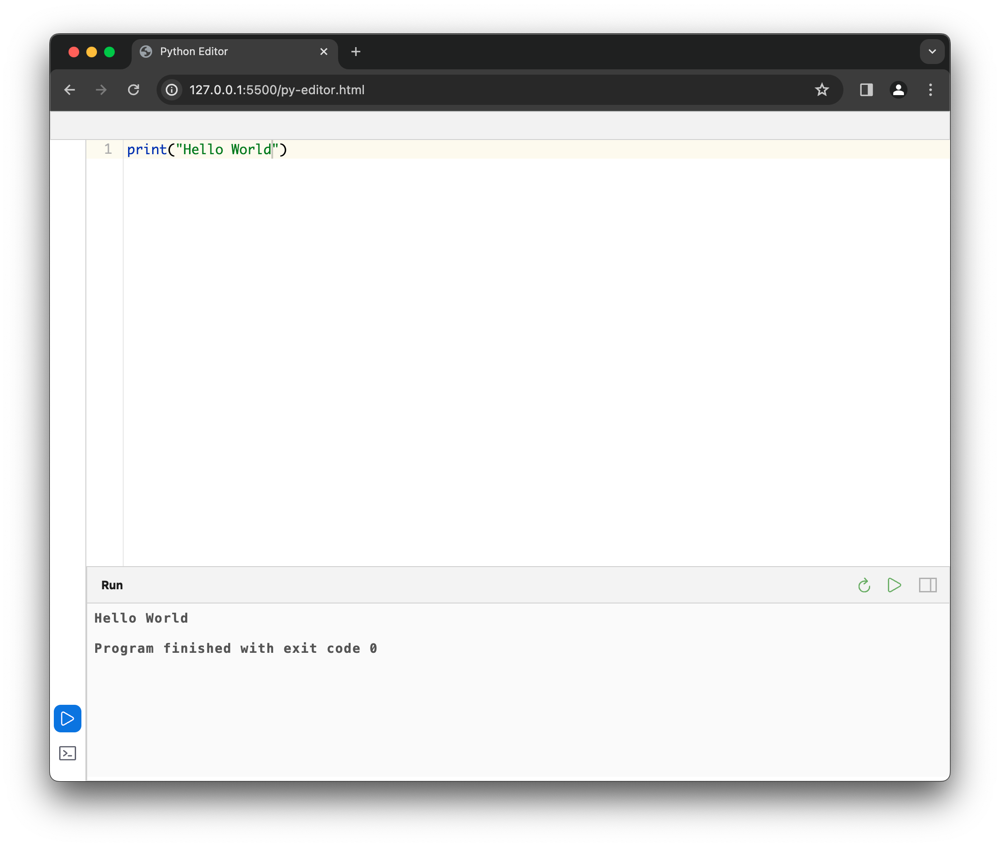

<div align="center">

# Online Python Editor


A browser-based Python code editor and execution environment.

</div>

## Features

- Run Python code directly in your browser without any backend services
- Syntax highlighting with Ace Editor
- Interactive console mode
- Error highlighting
- No installation required

## Live Demo

Try it now: [GitHub Pages Demo](https://github.com/yourusername/online-python-editor)

## How It Works

This project uses:
1. [Pyodide](https://pyodide.org/en/stable/) - Python compiled to WebAssembly
2. [Ace Editor](https://ace.c9.io) - A high performance code editor for the web
3. [Xterm.js](https://xtermjs.org) - Terminal emulator for the web

## Deployment

The project can be deployed on any static web hosting service:

1. Clone the repository
2. Host the files on any static web server (GitHub Pages, Netlify, Vercel, etc.)
3. No build process or server-side code required

## Local Development

To run locally:
```
# Using Python's built-in HTTP server
python -m http.server 8000

# Or any other static file server
```

Then open `http://localhost:8000` in your browser.
