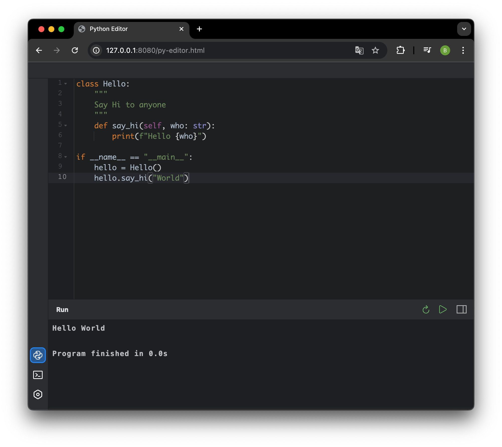

<div align="center">

# Online Python Editor


A browser-based Python code editor and execution environment.

</div>

## Features

- Run Python code directly in your browser without any backend services
- Syntax highlighting with Ace Editor
- Interactive console mode
- Error highlighting
- Multiple themes (Light, Dark, and Darcula)
- Responsive layout with vertical and horizontal modes
- Real-time execution output
- No installation required

## Themes

The editor supports multiple themes to suit your preferences:

| Light Theme | Dark Theme | Darcula Theme |
|-------------|------------|---------------|
|  |  |  |

## Console Mode

Interactive console mode lets you run Python commands and see output in real-time:


## Live Demo

Try it now: [GitHub Pages Demo](https://steeldregg.github.io/online-python-editor/py-editor.html)

## How It Works

This project uses:
1. [Pyodide](https://pyodide.org/en/stable/) - Python compiled to WebAssembly
2. [Ace Editor](https://ace.c9.io) - A high performance code editor for the web
3. [Xterm.js](https://xtermjs.org) - Terminal emulator for the web

## Project Structure

```
├── assets/           # SVG icons and graphics
├── docs/             # Documentation and showcase images
├── font/             # Custom fonts
├── style/            # CSS styling files
├── vendor/           # Third-party libraries
│   ├── ace/          # Ace Editor
│   ├── pyodide/      # Python WebAssembly runtime
│   └── xterm/        # Terminal emulator
├── py-editor.html    # Main application
└── py-worker.js      # Web Worker for Python execution
```

## Deployment

The project can be deployed on any static web hosting service:

1. Clone the repository
2. Host the files on any static web server (GitHub Pages, Netlify, Vercel, etc.)
3. No build process or server-side code required

## Local Development

To run locally:
```
# Using Python's built-in HTTP server
python -m http.server 8000

# Or alternatively, use the included simple server
python simpleServer.py
```

Then open `http://localhost:8000/py-editor.html` in your browser.
